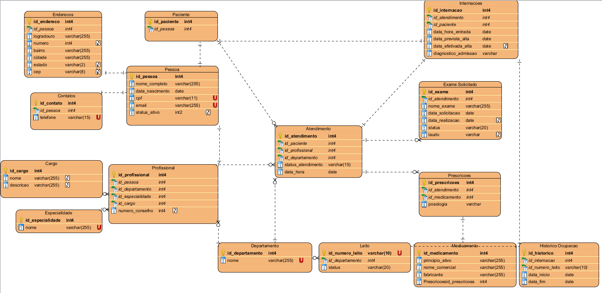

# 🏥 Sistema de Gestão Hospitalar: Vitalys

Um sistema robusto de banco de dados projetado para modernizar e otimizar a administração e os processos assistenciais em hospitais. Desenvolvido como trabalho acadêmico para a disciplina de Banco de Dados.

---

## 🎯 Objetivo

Nosso principal objetivo é resolver o problema comum da fragmentação das informações em ambientes hospitalares, integrando dados de pacientes, atendimentos, profissionais e recursos em uma única plataforma.

Com este sistema, buscamos garantir:

* **Acesso Rápido e Organizado**: Médicos, enfermeiros e gestores terão acesso facilitado a informações cruciais como histórico clínico, disponibilidade de leitos e desempenho de departamentos.
* **Decisões Ágeis**: Facilitar a tomada de decisões rápidas e embasadas.
* **Atendimento Eficiente e Humanizado**: Promover um cuidado mais integrado e de qualidade para os pacientes.

---

## ✨ Funcionalidades

| Módulo                         | Descrição                                                                                                                                                                                                                                                                                                  |
| :----------------------------- | :--------------------------------------------------------------------------------------------------------------------------------------------------------------------------------------------------------------------------------------------------------------------------------------------------------- |
| **Cadastros Essenciais** | Centraliza informações de pacientes (completo, contatos e endereços), profissionais (cargos, especialidades), departamentos e gestão de leitos. Permite a organização da equipe e alocação eficiente de recursos humanos e físicos.                                                                        |
| **Atendimentos e Internações** | Registra de forma detalhada e cronológica todos os atendimentos e internações, garantindo a continuidade do cuidado e o acompanhamento detalhado do paciente durante sua permanência hospitalar.                                                                                                            |
| **Histórico Clínico Integrado** | Consolida informações sobre exames solicitados, resultados, medicamentos prescritos e anotações médicas. Essencial para a segurança no tratamento, evitando erros de medicação e proporcionando uma visão completa da jornada do paciente.                                                                   |
| **Relatórios Estratégicos** | Transforma dados coletados em informações acionáveis para a gestão hospitalar. Auxilia na identificação de demandas, monitoramento da produtividade e na tomada de decisões estratégicas para melhoria de processos e otimização de recursos.                                                               |

---

## 💻 Tecnologias Utilizadas

Este projeto foi construído com as seguintes tecnologias e ferramentas:

* **Banco de Dados:** **PostgreSQL** (para armazenamento e manipulação de dados).
* **Modelagem de Dados:** **Visual Paradigm** (para diagramas ER e design do banco).
* **Desenvolvimento:** **VS Code (Visual Studio Code)** (para escrita de scripts SQL).
* **Gerenciamento de Banco de Dados:** **DBeaver** (para administração e exploração do banco).

---

## 🏗️ Estrutura do Projeto

A organização do projeto segue uma estrutura clara para facilitar o entendimento e a manutenção:

* **Modelagem:** Diagramas e dicionários de dados que definem as tabelas e suas relações. O diagrama abaixo representa o modelo relacional do banco de dados Vitalys.

    

    A estrutura de pastas para a modelagem é a seguinte:
    ```plaintext
    Vitalys/
    ├── DiagramaRelacional/
    │   ├── Vitalys.vpp              # Arquivo editável do Visual Paradigm
    │   └── diagrama.png             # Imagem do modelo relacional exportada
    │
    └── DicionarioDados/
        ├── Atendimento.csv
        ├── Cargo.csv
        ├── Contatos.csv
        ├── Departamento.csv
        ├── Endereco.csv
        ├── Especialidade.csv
        ├── Exame_Solicitado.csv
        ├── Historico_Ocupacao.csv
        ├── Internacao.csv
        ├── Leito.csv
        ├── Medicamento.csv
        ├── Paciente.csv
        ├── Pessoa.csv
        ├── Prescricoes.csv
        └── Profissional.csv
    ```

* **Implementação:** Scripts SQL para a criação do banco, tabelas, índices e regras de integridade.
    Abaixo, um exemplo de script para criação de tabela:

    ```sql
    CREATE TABLE Pessoa (
        id_pessoa int4 NOT NULL,
        nome_completo varchar(255) NOT NULL,
        data_nascimento date NOT NULL,
        cpf varchar(11) NOT NULL UNIQUE,
        email varchar(255) NOT NULL UNIQUE,
        status_ativo int2 DEFAULT 1,
        PRIMARY KEY (id_pessoa)
    );
    ```
    Neste script, foram utilizadas as seguintes constraints para garantir a integridade e a qualidade dos dados:
    * **`PRIMARY KEY`**: Define uma coluna ou conjunto de colunas que identifica unicamente cada registro em uma tabela, garantindo unicidade e não-nulidade.
    * **`FOREIGN KEY`**: Estabelece um vínculo entre dados em duas tabelas, garantindo a integridade referencial (os dados em uma tabela devem corresponder aos dados em outra).
    * **`NOT NULL`**: Garante que uma coluna não possa conter valores nulos, exigindo que um valor seja sempre inserido.
    * **`UNIQUE`**: Assegura que todos os valores em uma coluna (ou um grupo de colunas) sejam diferentes uns dos outros, evitando duplicidade de informações específicas.

    A estrutura de pastas para os scripts de criação é:
    ```plaintext
    Vitalys/
    └── ScriptsCriacao/
        ├── Scripts.sql              # Script com a criação do banco, tabelas e índices
        └── Constraints.sql          # Script com a definição das constraints (chaves primárias, estrangeiras, etc.)
    ```

* **Consultas e Relatórios:** Scripts para extração de informações essenciais para análise e gestão hospitalar.

    A estrutura de pastas para as consultas e seus respectivos resultados é:
    ```plaintext
    Vitalys/
    └── Consultas/
        ├── Consulta1 - Relatório de Pacientes Ativos/
        │   ├── consulta.sql         # Script para extrair o relatório
        │   └── resposta.csv         # Resposta da consulta
        │
        ├── Consulta 2 - Relatório de Atendimentos de um Paciente/
        │   ├── consulta.sql         # Script para extrair o relatório
        │   └── resposta.csv         # Resposta da consulta
        │
        ├── Consulta 3 - Relatório de Atendimentos por Profissional de Saúde/
        │   ├── consulta.sql         # Script para extrair o relatório
        │   └── resposta.csv         # Resposta da consulta
        │
        └── Consulta 4 - Relatório Resumido de Atendimentos por Departamento/
                ├── consulta.sql         # Script para extrair o relatório
                └── resposta.csv         # Resposta da consulta
    ```

---

## 👥 Equipe

Conheça os membros da equipe que desenvolveram este projeto:

| Foto                                 | Nome                  |
| :-----------------------------------: | :-------------------- |
|  | Alexandre Luft Duarte |
|          | Ivan Lopes Nerilo     |
|  | Rafael Gustavo Vivian |

---

## 📝 Conclusão

Este Sistema de Gestão Hospitalar oferece uma solução integrada e eficiente para instituições de saúde que buscam aprimorar a organização, a comunicação e a qualidade do atendimento aos pacientes. Ao centralizar e estruturar informações críticas, ele facilita o trabalho da equipe médica e administrativa, promove a segurança nos tratamentos e apoia a gestão na tomada de decisões estratégicas, contribuindo para um cuidado mais ágil, preciso e humanizado.

---
